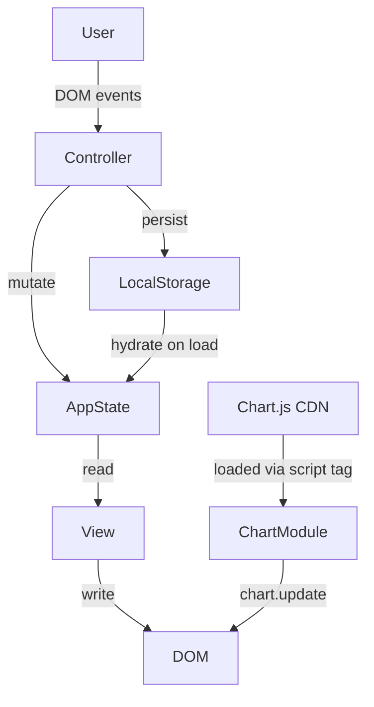

# Design Document — Expense & Budget Visualizer

## Overview

The Expense & Budget Visualizer is a zero-dependency, zero-build client-side web application. All application logic, state management, rendering, and persistence run inside a single browser session. There is no server, no bundler, and no package registry involvement at runtime.

The app lets a user:
- Log expense transactions (name, amount, category)
- Review and delete those transactions from a scrollable list
- See the running total balance with an optional overspending highlight
- Visualize category spending on a Chart.js v4 pie chart
- Sort the list by amount or category
- Switch between light and dark themes

All persistent state is stored exclusively in `localStorage` using predefined string keys. The only external resource loaded is Chart.js v4.x from a CDN `<script>` tag.

### File Structure

```
project-root/
├── index.html          ← single HTML file, links CSS and JS
├── css/
│   └── style.css       ← all styling, custom properties for theming
└── js/
    └── app.js          ← all application logic
```

---

## Architecture

The architecture follows a simple **MVC-lite** pattern implemented entirely in vanilla JS:

- **Model** — The authoritative in-memory state object (`AppState`) and the `Storage` module that serialises/deserialises it to `localStorage`.
- **View** — Pure functions that read state and write to the DOM. They never mutate state.
- **Controller** — Event handlers that call model mutations, then trigger view re-renders.



### Rendering Strategy

Every state mutation is followed by a full **synchronous re-render** of all affected UI zones. Given the data size (single-user local data, typically <1 000 transactions), a full re-render on each change is fast enough to comfortably meet all 100 ms / 300 ms latency budgets from the requirements without a virtual DOM or diffing.

The rendering pipeline for any state-changing event is:

1. Validate input (if user-submitted).
2. Mutate `AppState`.
3. Persist to `localStorage`.
4. Call `render()` → updates Balance, Transaction_List, Chart, Spending Limit indicator, and Theme class in one pass.

### Theme Management

Theme is toggled by adding/removing a CSS class (`theme-dark`) on `<body>`. All color values are declared as CSS custom properties on `:root` (light defaults) and overridden under `body.theme-dark`. This ensures the entire page repaints in a single style-recalculation pass.

---

## Components and Interfaces

### 1. `AppState` (Module-level singleton)

Holds all runtime state. Initialised by `Storage.load()` on page load.

```js
// Internal state shape (not exported directly)
let state = {
  transactions: [],   // Transaction[]  — ordered newest-first
  spendingLimit: null, // number | null
  theme: 'light',     // 'light' | 'dark'
};
```

Public interface (functions, not direct property access):

| Function | Signature | Description |
|---|---|---|
| `getTransactions()` | `() → Transaction[]` | Returns a shallow copy of the transactions array |
| `addTransaction(tx)` | `(Transaction) → void` | Prepends tx to transactions, persists, re-renders |
| `deleteTransaction(id)` | `(string) → void` | Removes tx by id, persists, re-renders |
| `setSpendingLimit(val)` | `(number\|null) → void` | Updates limit, persists, re-renders |
| `setTheme(theme)` | `('light'\|'dark') → void` | Updates theme, persists, re-renders |
| `loadFromStorage()` | `() → void` | Hydrates state from localStorage on startup |

### 2. `Storage` Module

Thin wrapper around `localStorage`. All keys are constants.

```js
const KEYS = {
  TRANSACTIONS: 'ebv_transactions',
  SPENDING_LIMIT: 'ebv_spending_limit',
  THEME: 'ebv_theme',
};
```

| Function | Description |
|---|---|
| `save(key, value)` | `JSON.stringify(value)` into localStorage; catches `QuotaExceededError` |
| `load(key)` | `JSON.parse` from localStorage; returns `null` on missing or parse error |

### 3. `InputForm` Component

Manages the transaction entry form. Lives in `index.html`; JS attaches a `submit` listener.

**Responsibilities:**
- Field-level validation (name not empty, amount valid, category selected)
- On valid submit: constructs a `Transaction`, calls `addTransaction()`, resets fields
- On invalid submit: renders error messages adjacent to offending fields without clearing valid fields

**Validation rules (Amount):**
- Must be a finite number
- Must be > 0
- Must be ≤ 999,999,999.99
- Must have at most 2 decimal places (tested via regex `/^\d+(\.\d{1,2})?$/`)

### 4. `TransactionList` Component

Renders all transactions into a `<ul>` element.

- Reads `state.transactions`, applies the active sort, then builds `<li>` elements.
- Each `<li>` contains: item name, formatted amount, category badge, delete `<button>`.
- Empty-state `<p>` is shown/hidden based on list length.
- Delete button dispatches `deleteTransaction(id)`.

### 5. `BalanceDisplay` Component

Renders the current balance prominently.

- Reads `computeBalance(state.transactions)`.
- Formats with `formatCurrency()`.
- Applies `.balance--over-limit` CSS class when `balance > state.spendingLimit` and `spendingLimit` is set.

### 6. `SpendingLimitControl` Component

An `<input type="number">` with a submit button / blur handler.

- Validates: non-empty, finite, > 0, ≤ 999,999,999.99, ≤ 2 decimal places.
- On valid input: calls `setSpendingLimit(value)`.
- On invalid: displays an error message adjacent to the control.
- On load: restores the stored value from state.

### 7. `ChartManager` Module

Owns the single Chart.js instance.

```js
let chartInstance = null;

function initChart(ctx) { ... }   // creates the Doughnut/Pie chart
function updateChart(transactions) { ... }  // recomputes data arrays, calls chart.update()
function showChartError(msg) { ... }        // renders error text in chart area
```

- On load, detects whether `Chart` is defined on `window`; if not, calls `showChartError()` and skips all chart operations.
- On each re-render, calls `computeCategoryTotals(transactions)` and feeds the result to `chart.data`. Segments with 0 total are filtered out.
- Chart instance is created once in `initChart`; subsequent updates call `chart.update()` (no destroy/recreate).

### 8. `SortControl` Component

A `<select>` element with four options mapped to sort keys:

| Option label | Sort key | Comparator |
|---|---|---|
| Default (newest first) | `'default'` | insertion order (index) |
| Amount ↑ | `'amount_asc'` | `a.amount - b.amount` |
| Amount ↓ | `'amount_desc'` | `b.amount - a.amount` |
| Category A→Z | `'category_asc'` | `a.category.localeCompare(b.category)` |

Sort state is stored in a module-level variable `currentSort`; it is NOT persisted to localStorage (resets to default on page load, matching the requirements).

### 9. `ThemeToggle` Component

A `<button>` with an accessible label.

- On click: calls `setTheme(newTheme)`.
- `render()` updates the button's label/icon and toggles `body.theme-dark`.

---

## Data Models

### Transaction

```js
/**
 * @typedef {Object} Transaction
 * @property {string} id        - UUID v4 generated at creation (crypto.randomUUID())
 * @property {string} name      - Item name, 1–100 characters
 * @property {number} amount    - Stored as a JavaScript number; always exactly 2 decimal
 *                                places (enforced by parseAmount())
 * @property {string} category  - 'Food' | 'Transport' | 'Fun'
 * @property {number} timestamp - Date.now() at creation, used for default sort order
 */
```

**ID generation:** `crypto.randomUUID()` is supported in all modern browsers (Chrome 92+, Firefox 95+, Edge 92+, Safari 15.4+), satisfying the browser support requirement.

### AppState (serialised shape in localStorage)

`KEYS.TRANSACTIONS` stores a JSON array of `Transaction` objects:

```json
[
  {
    "id": "3f2504e0-4f89-11d3-9a0c-0305e82c3301",
    "name": "Lunch",
    "amount": 12.50,
    "category": "Food",
    "timestamp": 1718000000000
  }
]
```

`KEYS.SPENDING_LIMIT` stores a JSON number or is absent:

```json
500.00
```

`KEYS.THEME` stores a JSON string:

```json
"dark"
```

### Computed Values (never stored)

These are derived on every render from raw state:

```js
/**
 * Computes total balance using integer arithmetic to avoid floating-point drift.
 * @param {Transaction[]} transactions
 * @returns {number} — rounded to 2 decimal places
 */
function computeBalance(transactions) {
  const totalCents = transactions.reduce(
    (sum, tx) => sum + Math.round(tx.amount * 100),
    0
  );
  return totalCents / 100;
}

/**
 * Computes per-category totals using the same integer strategy.
 * @param {Transaction[]} transactions
 * @returns {{ Food: number, Transport: number, Fun: number }}
 */
function computeCategoryTotals(transactions) {
  const totals = { Food: 0, Transport: 0, Fun: 0 };
  for (const tx of transactions) {
    totals[tx.category] += Math.round(tx.amount * 100);
  }
  for (const key of Object.keys(totals)) {
    totals[key] = totals[key] / 100;
  }
  return totals;
}
```

### Currency Formatting

```js
/**
 * Formats a number as a USD-style currency string.
 * Uses Intl.NumberFormat for thousands separator and 2 decimal places.
 * @param {number} value
 * @returns {string}  e.g. "$1,234.56"
 */
const formatter = new Intl.NumberFormat('en-US', {
  style: 'currency',
  currency: 'USD',
  minimumFractionDigits: 2,
  maximumFractionDigits: 2,
});

function formatCurrency(value) {
  return formatter.format(value);
}
```

### Amount Parsing and Validation

```js
/**
 * Parses a raw string input into a validated amount number.
 * Returns { value: number } on success or { error: string } on failure.
 */
function parseAmount(raw) {
  const trimmed = raw.trim();
  if (trimmed === '') return { error: 'Amount is required.' };
  if (!/^\d+(\.\d{1,2})?$/.test(trimmed)) {
    return { error: 'Amount must be a positive number with up to 2 decimal places.' };
  }
  const value = parseFloat(trimmed);
  if (value <= 0) return { error: 'Amount must be greater than 0.' };
  if (value > 999_999_999.99) return { error: 'Amount exceeds the maximum allowed value.' };
  return { value };
}
```

---

## UI Layout

```
┌─────────────────────────────────────────────────────────┐
│  [☀/☾ Theme Toggle]          Expense & Budget Visualizer │
├─────────────────────────────────────────────────────────┤
│                    TOTAL BALANCE                        │
│                     $1,234.56   ← highlighted if over   │
├──────────────────────────┬──────────────────────────────┤
│  Add Transaction         │   Spending by Category       │
│  ┌────────────────────┐  │   ┌──────────────────────┐  │
│  │ Item Name          │  │   │   [Pie Chart]        │  │
│  │ Amount             │  │   │                      │  │
│  │ Category ▾         │  │   │  ● Food              │  │
│  │ [Add Transaction]  │  │   │  ● Transport         │  │
│  └────────────────────┘  │   │  ● Fun               │  │
│                          │   └──────────────────────┘  │
│  Spending Limit          │                              │
│  ┌──────────────────┐    │                              │
│  │ Limit Amount     │    │                              │
│  │ [Set Limit]      │    │                              │
│  └──────────────────┘    │                              │
├──────────────────────────┴──────────────────────────────┤
│  Transactions                  Sort: [Default ▾]        │
│  ┌─────────────────────────────────────────────────┐   │
│  │ Lunch          $12.50    [Food]      [Delete]   │   │
│  │ Bus pass       $30.00    [Transport] [Delete]   │   │
│  │ …                                               │   │
│  └─────────────────────────────────────────────────┘   │
│  (scrollable; shows "No transactions yet" when empty)   │
└─────────────────────────────────────────────────────────┘
```

---

## State Management

All mutable state lives in a single module-scoped `state` object in `app.js`. No global variables are leaked onto `window`.

### Initialisation Sequence

```
DOMContentLoaded
  └─ loadFromStorage()          ← hydrates state from localStorage
       ├─ parse transactions     ← fallback: []
       ├─ parse spendingLimit    ← fallback: null
       └─ parse theme            ← fallback: 'light'
  └─ applyTheme(state.theme)    ← sets body class before paint
  └─ initChart(canvasCtx)       ← creates Chart.js instance
  └─ render()                   ← full initial render
  └─ attachEventListeners()     ← wires all DOM event handlers
```

### Render Function

```js
function render() {
  renderBalance();          // computeBalance → format → DOM
  renderTransactionList();  // apply sort → build <li> nodes → swap innerHTML
  renderChart();            // computeCategoryTotals → chart.update()
  renderSpendingLimit();    // populate limit input value
  renderThemeToggle();      // update button label
}
```

`render()` is always called **after** state mutation and persistence. Because it's synchronous and operates on in-memory state, it completes well within 100 ms for any realistic dataset.

### Sort State

`currentSort` is a module-level string (`'default'`, `'amount_asc'`, `'amount_desc'`, `'category_asc'`). It is not part of the persisted `AppState`. `renderTransactionList()` reads it to produce the display order without touching `state.transactions`.

```js
function getSortedTransactions() {
  const txs = [...state.transactions]; // shallow copy — never mutate state
  switch (currentSort) {
    case 'amount_asc':    return txs.sort((a, b) => a.amount - b.amount);
    case 'amount_desc':   return txs.sort((a, b) => b.amount - a.amount);
    case 'category_asc':  return txs.sort((a, b) =>
                            a.category.localeCompare(b.category));
    default:              return txs; // already newest-first from addTransaction prepend
  }
}
```

---

## Error Handling

| Scenario | Handling |
|---|---|
| Invalid transaction form input | Inline error messages per field; form not submitted |
| Invalid spending limit input | Inline error message; limit not updated |
| `localStorage` write failure (`QuotaExceededError`) | Catch in `Storage.save()`; display a toast/banner error; do not apply state mutation |
| `localStorage` read failure (corrupted JSON) | `Storage.load()` returns `null`; caller uses default value; app continues normally |
| Chart.js CDN load failure | `window.Chart` undefined check on init; display error in chart area; all other features remain functional |
| `crypto.randomUUID` unavailable | Fallback: `Date.now().toString(36) + Math.random().toString(36).slice(2)` for ID generation |

### Error Display

Validation errors are displayed as `<span class="field-error">` elements placed immediately after their associated `<input>` or `<select>`. They are cleared on each re-validation attempt. Non-validation errors (storage failure) are shown in a dismissible banner at the top of the page.

---

## Testing Strategy

### Unit Tests

Target: pure functions that contain business logic — no DOM, no localStorage.

Key functions to unit-test:

| Function | What to verify |
|---|---|
| `computeBalance` | Correct sum; returns 0 for empty array; floating-point safety |
| `computeCategoryTotals` | Correct per-category sums; zero categories included as 0 |
| `parseAmount` | Rejects empty, negative, zero, >2 decimals, >max; accepts boundary values |
| `formatCurrency` | Correct symbol, separator, decimal formatting |
| `getSortedTransactions` | Each sort option produces correct order; does not mutate original array |
| `Storage.load` | Returns default on missing key, null on corrupt JSON |

### Integration / Example Tests

| Scenario | What to verify |
|---|---|
| Add transaction end-to-end | List length grows, balance updates, chart data updates |
| Delete transaction end-to-end | List shrinks, balance updates, chart data updates |
| Spending limit set + balance exceeds | `.balance--over-limit` class applied |
| Theme toggle | `body.theme-dark` class toggled; localStorage updated |
| Page reload with persisted data | State fully restored before interaction |
| Chart.js absent | Error shown in chart area; form, list, balance still functional |

### Property-Based Tests

See **Correctness Properties** section below. Property tests use a PBT library (e.g., [fast-check](https://github.com/dubzzz/fast-check) for JavaScript). Each property test runs a minimum of **100 iterations** with randomly generated inputs.

Tag format: `// Feature: expense-budget-visualizer, Property N: <property_text>`


---

## Correctness Properties

*A property is a characteristic or behavior that should hold true across all valid executions of a system — essentially, a formal statement about what the system should do. Properties serve as the bridge between human-readable specifications and machine-verifiable correctness guarantees.*

The properties below were derived from the acceptance criteria. Each is universally quantified and is intended to be implemented as a property-based test using [fast-check](https://github.com/dubzzz/fast-check).

---

### Property 1: Balance Invariant (Fixed-Point Arithmetic)

*For any* array of transactions (including the empty array), `computeBalance(transactions)` SHALL equal the sum of all amounts computed via integer arithmetic (`Math.round(amount * 100)` per amount, divided by 100 at the end), and the result SHALL have at most 2 decimal places.

This consolidates and ensures: balance is always the correct sum (after add, after delete, when empty), no floating-point drift accumulates, and the `$0.00` empty-state is a natural consequence.

**Validates: Requirements 4.2, 4.3, 4.4, 4.5**

---

### Property 2: Valid Transaction Creation and Form Reset

*For any* valid transaction input (item name of 1–100 non-whitespace characters, amount in the range [0.01, 999,999,999.99] with at most 2 decimal places, category one of Food / Transport / Fun), after `addTransaction()` is called:
- The transaction array length SHALL increase by exactly 1.
- The newly added transaction SHALL be the first element of `getTransactions()` (newest-first insertion).
- The corresponding `localStorage` entry SHALL contain the transaction.
- All form fields SHALL be reset to their initial values (name → empty, amount → empty, category → Food).

**Validates: Requirements 1.2, 1.5, 2.6, 9.1**

---

### Property 3: Input Validation — Any Invalid Input Is Rejected

*For any* form submission where at least one field is invalid (name is empty / whitespace-only; amount is zero, negative, non-numeric, greater than 999,999,999.99, or has more than 2 decimal places; spending limit with the same constraints), the system SHALL:
- NOT add a transaction (transaction count unchanged).
- Display a validation error message adjacent to each offending field.
- NOT modify `localStorage`.

This covers both transaction form validation and spending limit validation.

**Validates: Requirements 1.3, 1.4, 7.2**

---

### Property 4: Default Sort Preserves Newest-First Insertion Order

*For any* sequence of transactions added over time (each with a distinct `timestamp`), when `currentSort` is `'default'`, `getSortedTransactions()` SHALL return the transactions ordered by `timestamp` descending (newest first), without modifying the underlying `state.transactions` array.

**Validates: Requirements 2.3, 6.3**

---

### Property 5: Sort Correctness and Non-Destructiveness

*For any* non-empty array of transactions and *for any* sort option (`'amount_asc'`, `'amount_desc'`, `'category_asc'`):
- `getSortedTransactions()` SHALL return a new array (not a mutation of the original) in the correct order as defined by the sort comparator for that option.
- The contents of `localStorage` (the `ebv_transactions` key) SHALL remain byte-for-byte unchanged after calling `getSortedTransactions()`.
- After any transaction add or delete while a non-default sort is active, the next render SHALL apply the same sort to the updated list.

**Validates: Requirements 6.2, 6.3, 6.4**

---

### Property 6: Chart Data Accuracy — Only Non-Zero Categories Appear

*For any* array of transactions, `computeCategoryTotals(transactions)` SHALL:
- Return a per-category total using the same fixed-point arithmetic as `computeBalance`.
- Produce category totals where each category's value equals the sum of all transaction amounts for that category.

And the data fed to the Chart.js instance SHALL:
- Contain only the categories whose computed total is strictly greater than 0.
- Have category totals that exactly match `computeCategoryTotals` for those categories.

This holds after any add, delete, or page-load event.

**Validates: Requirements 5.1, 5.2, 5.3, 5.4**

---

### Property 7: Overspend Indicator Is Bidirectionally Correct

*For any* combination of transactions and spending limit value:
- IF `computeBalance(transactions) > spendingLimit` AND `spendingLimit` is not null, THEN the Balance display element SHALL have the `.balance--over-limit` CSS class applied.
- IF `computeBalance(transactions) ≤ spendingLimit` OR `spendingLimit` is null, THEN the Balance display element SHALL NOT have the `.balance--over-limit` CSS class.

This invariant SHALL hold immediately after any state change: transaction added, transaction deleted, or spending limit updated.

**Validates: Requirements 7.3, 7.4, 7.5**

---

### Property 8: Full State Persistence Round-Trip

*For any* valid application state (any combination of transactions, spending limit, and theme), after all state-changing operations have been applied:
- `localStorage.getItem(KEYS.TRANSACTIONS)` SHALL deserialize to a transaction array equal to `state.transactions`.
- `localStorage.getItem(KEYS.SPENDING_LIMIT)` SHALL deserialize to a number equal to `state.spendingLimit` (or be absent/null when no limit is set).
- `localStorage.getItem(KEYS.THEME)` SHALL equal `state.theme` (`'light'` or `'dark'`).

Conversely, given those values already in `localStorage`, calling `loadFromStorage()` SHALL restore `state` such that `getTransactions()`, `spendingLimit`, and `theme` equal the persisted values.

**Validates: Requirements 7.6, 8.3, 8.5, 9.1, 9.2**

---

### Property 9: Theme Toggle Is Idempotent and Persistent

*For any* current theme value (`'light'` or `'dark'`), calling `setTheme(newTheme)`:
- SHALL set `document.body.classList` to contain `'theme-dark'` if and only if `newTheme === 'dark'`.
- SHALL write `newTheme` to `localStorage` under `KEYS.THEME`.
- Calling `setTheme` with the same value twice SHALL produce the same DOM and localStorage state as calling it once (idempotence).

**Validates: Requirements 8.2, 8.3**
